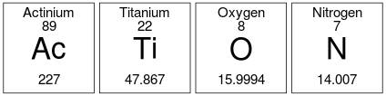
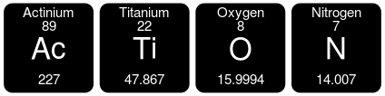
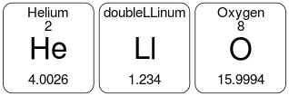

#chemSymWords
Convert words into chemical symbols

This is a small library to convert words into chemical symbols found in the periodic table.


## Install
```r
devtools::install_github("harveyl888/chemSymWords")
```

## Usage
The library contains two functions

`chemWord(w, output=c('min', 'max', 'list'), sym=elements, additional=NULL)`  
Take a word, w, and convert it into chemical symbols.  Output is shortest string (min), longest string (max) or all element strings (list).  sym corresponds to a data frame containing elements (defaulting to `elements`).  An additional dataframe may be included containing further (fabricated?) elements.  If the string cannot be represented by elements then FALSE is returned.

`chemWordPNG(w, sym=elements, line1=c('Name', 'center'), line2=c('Atomic_Number', 'center'), line3=c('Atomic_Mass', 'center'), additional=NULL, colorInvert = FALSE, rounded = FALSE, f='chemWord.png')`
Create a PNG of chemical elements from a string, w and write it to a file, f.  sym corresponds to a data frame containing elements (defaulting to `elements`).  An additional dataframe may be included containing further (fabricated?) elements.  The chemical element will be centered in each tile and line1, line2 and line3 allow for additional labels to be placed, each comprising of the name of a column header (from sym or additional) followed by horizontal alignment (left, right, center).  Element tiles are displayed as black text on white background unless colorInvert is TRUE and will have rounded corners if rounded is TRUE.

## Examples
```r
chemWord(w = 'action')
```
<pre>"Ac" "Ti" "O"  "N"</pre>  

```r
chemWordPNG(w = 'action', f = './images/chemword1.png')
```

<br/>

```r
chemWordPNG(w = 'action', colorInvert = TRUE, rounded = TRUE, f = './images/chemword2.png')
```


```r
df.additional <- data.frame(Symbol = 'Ll', Name = 'doubleLLinum', Atomic_Mass = 1.234, stringsAsFactors = FALSE)
chemWordPNG(w = 'hello', additional = df.additional, rounded = TRUE, f = './images/chemword3.png')
```


